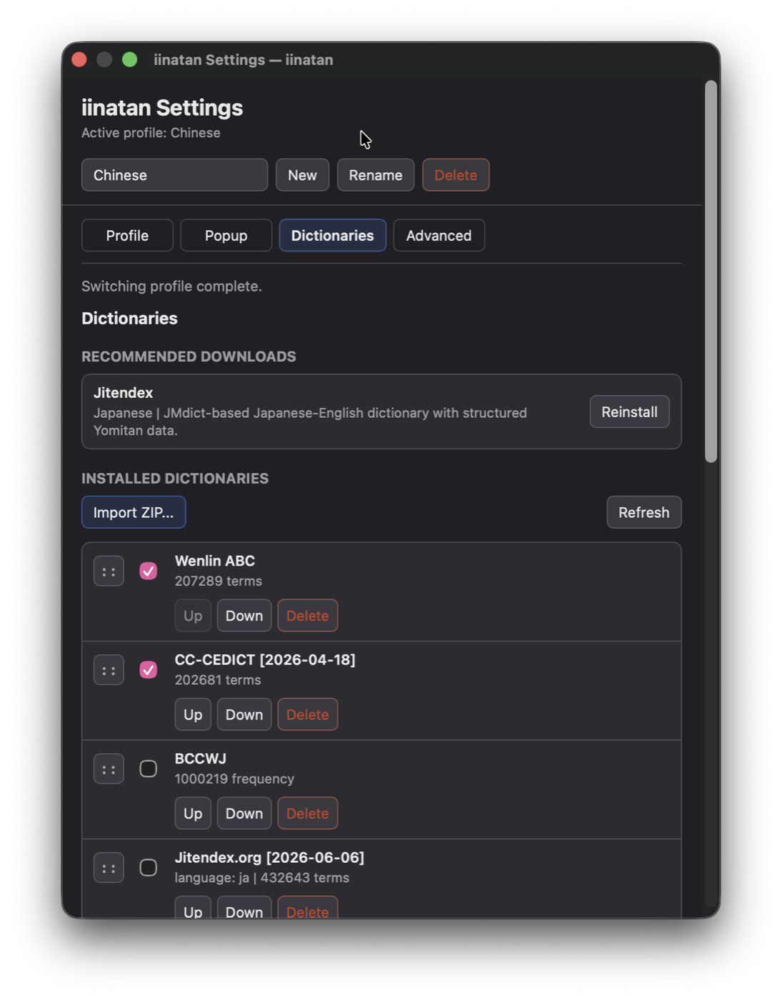

# iinatan

iinatan adds dictionary popups to subtitles in IINA on macOS. Pause a video, hover a word, and look it up without leaving the player.

The plugin is still experimental, but the core workflow is usable today: install a dictionary, choose a lookup language, toggle iinatan on, and use it while watching subtitled video.

Anki export is not supported yet.

## Screenshots

| English lookup and language menu | Dictionary settings |
| --- | --- |
|  |  |

## What You Get

- Dictionary lookups directly on IINA subtitles.
- Pause-only behavior, so popups do not interrupt normal playback.
- Japanese, English, French, German, Chinese, and Korean lookup modes.
- Built-in installer for the recommended Japanese dictionary, Jitendex.
- Import support for local Yomitan-compatible dictionary ZIP files.
- Frequency and pitch-accent details for Japanese dictionaries that include them.
- Compact popups with structured entries, tags, source links, collapsed long sections, and custom CSS.
- Profiles for keeping separate language, dictionary, popup, and playback setups.

## Installation

For most users, the recommended option is the release package. Installing directly from GitHub follows the latest repository contents, so it can break temporarily when new commits are pushed.

### Install a Release Package (Recommended)

Download `iinatan.iinaplgz` from the [latest version on GitHub](https://github.com/afn478/iinatan/releases/latest) and install it through IINA's plugin manager.

### Install From GitHub
Use this only if you want the newest in-progress changes and are comfortable with occasional breakage.

1. Open IINA's plugin manager.
2. Choose **Install from GitHub**.
3. Enter `afn478/iinatan`.
4. Enable the plugin.
5. Open **Plugins -> iinatan -> Settings...**.
6. Install the recommended dictionary, or import a Yomitan-compatible dictionary ZIP.
7. Toggle iinatan with **Shift+H**.

## Quick Start

### Japanese

1. Open **Plugins -> iinatan -> Settings...**.
2. Set the lookup language to **Japanese**.
3. Install **Jitendex** from the dictionary panel.
4. Make sure Jitendex is enabled.
5. Open a video with Japanese subtitles.
6. Toggle iinatan with **Shift+H**.
7. Pause playback and hover subtitle text.

### Other Languages

1. Open **Plugins -> iinatan -> Settings...**.
2. Choose the lookup language you want to use.
3. Import a compatible dictionary ZIP.
4. Enable the dictionary and move it into the order you prefer.
5. Pause playback and hover subtitle text.

If the popup does not appear, press **Shift+H** to toggle iinatan on.

## Dictionaries

The dictionary panel lets you:

- Install Jitendex for Japanese.
- Import local Yomitan-compatible dictionary ZIP files.
- Enable or disable installed dictionaries.
- Reorder dictionaries to choose which results appear first.

Language support depends on the dictionaries you install. iinatan currently has lookup modes for:

- Japanese
- English
- French
- German
- Chinese
- Korean

Some dictionary ZIP files do not label their language clearly. When that happens, iinatan may still let you import the file, but you may need to choose the right lookup language yourself.

## Settings

Open **Plugins -> iinatan -> Settings...** to manage the plugin.

Common settings include:

- Lookup language
- Installed dictionaries and result priority
- Subtitle and popup appearance
- Playback behavior
- Advanced import and lookup options
- Profiles for separate setups

The IINA plugin menu also includes **Settings...** and quick profile switching.

## Troubleshooting

- If no popup appears, press **Shift+H** and try again while playback is paused.
- If a dictionary does not return results, check that it is enabled and that the current lookup language matches it.
- If the plugin stalls, restart IINA.

## Development / Contributing

Development notes, build commands, test commands, packaging details, and release steps live in [CONTRIBUTING.md](CONTRIBUTING.md).

## License

iinatan is licensed under the GNU General Public License v3.0 only (`GPL-3.0-only`). See `LICENSE` for the full license text.

## Thanks

- [Yomipv](https://github.com/BrenoAqua/Yomipv) for the original idea of bringing Yomitan-style lookup into mpv.
- [Yomitan](https://github.com/yomidevs/yomitan) for the inspiration behind the popup dictionary experience.
- [HoshiDicts](https://github.com/Manhhao/hoshidicts/) for the dictionary engine used by iinatan.
- [Chimahon](https://github.com/sohilsayed/chimahon) and [Hoshi Reader Android](https://github.com/HuangAntimony/Hoshi-Reader-Android) for examples of compact, reader-friendly lookup design.
