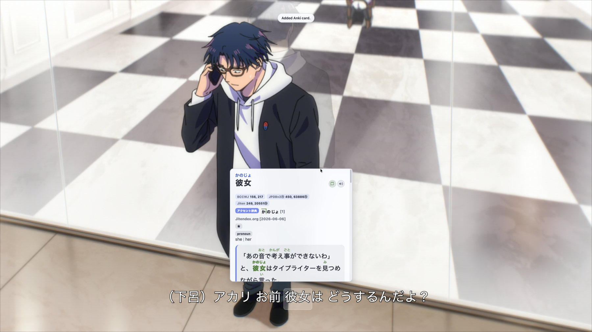
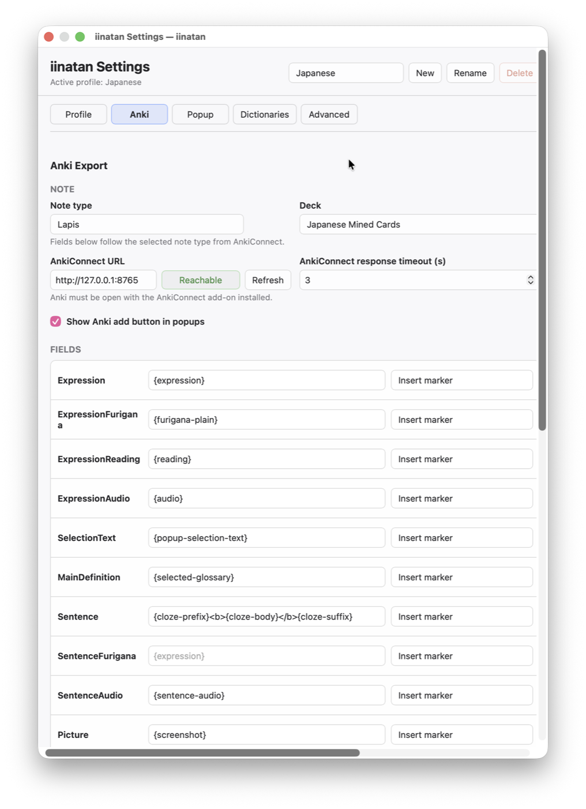
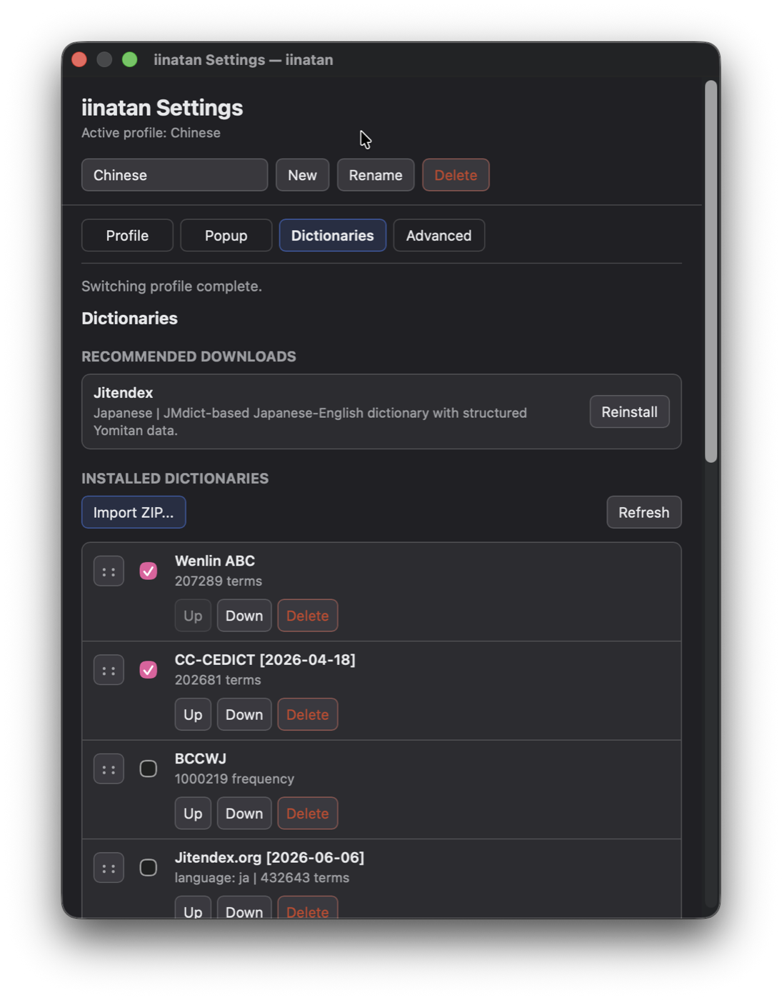
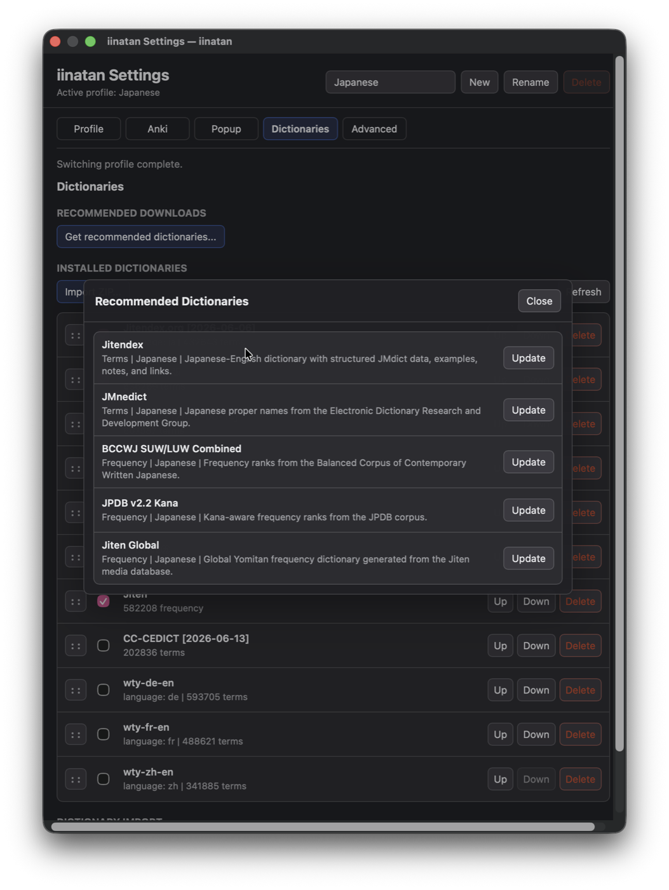

# iinatan

iinatan adds dictionary popups to subtitles in IINA on macOS. Pause a video, hover a word, and look it up without leaving the player.

The plugin is still experimental, but the core workflow is usable today: install a dictionary, choose a lookup language, toggle iinatan on, and use it while watching subtitled video.

Anki export is available through AnkiConnect when Anki is running in the background.

## Screenshots



| German lookup | Anki setup |
| --- | --- |
|  |  |
| Dictionary selection | Recommended dictionary downloads |
|  |  |

## What You Get

- Dictionary lookups directly on IINA subtitles.
- Automatic pause on dictionary lookup and resume afterwards
- Japanese, English, French, German, Chinese, and Korean lookup modes.
- Built-in downloader for recommended dictionaries and frequency data.
- Import support for local Yomitan-compatible dictionary ZIP files.
- Frequency and pitch-accent dictionary support for Japanese
- Compact popups with structured entries, tags, source links, collapsed long sections, and custom CSS.
- One-click Anki card creation with duplicate detection, subtitle sentences, screenshots, and subtitle audio.
- Profiles for keeping separate language, dictionary, popup, and anki export settings.

## Installation

For most users, the recommended option is the release package. Installing directly from GitHub follows the latest repository contents, so it can break temporarily when new commits are pushed.

### Install a Release Package (Recommended)

Download `iinatan.iinaplgz` from the [latest version on GitHub](https://github.com/afn478/iinatan/releases/latest) and install it through IINA's plugin manager.

### Install From GitHub
Use this only if you want the newest in-progress changes and are comfortable with occasional breakage.

1. Open IINA's plugin manager.
2. Choose **Install from GitHub**.
3. Enter `afn478/iinatan`.
4. Enable the plugin.
5. Open **Plugins -> iinatan -> Settings...**.
6. Install the recommended dictionary, or import a Yomitan-compatible dictionary ZIP.
7. Toggle iinatan with **Shift+H**.

## Quick Start

1. Open **Plugins -> iinatan -> Settings...**.
2. Choose the lookup language you want to use.
3. Go to the dictionaries section
3. Click `Get recommended Dictionaries...` and download the available dictionaries. Alternatively, import compatible dictionary ZIP files.
4. Enable and move dictionaries into the order you prefer.
5. Toggle iinatan with **Shift+H**.
6. Pause playback and hover subtitle text.

If the popup does not appear, press **Shift+H** to toggle iinatan on.

## Dictionaries

The dictionary panel lets you:

- Install Jitendex for Japanese.
- Import local Yomitan-compatible dictionary ZIP files.
- Enable or disable installed dictionaries.
- Reorder dictionaries to choose which results appear first.

Language support depends on the dictionaries you install. iinatan currently has lookup modes for:

- Japanese
- English
- French
- German
- Chinese
- Korean (Experimental)

Some dictionary ZIP files do not label their language clearly. When that happens, iinatan may still let you import the file, but you may need to choose the right lookup language yourself.

## Settings

Open **Plugins -> iinatan -> Settings...** to manage the plugin.

Common settings include:

- Lookup language
- Installed dictionaries and result priority
- Subtitle and popup appearance
- Playback behavior
- AnkiConnect export fields, duplicate behavior, screenshots, and sentence audio
- Advanced import and lookup options
- Profiles for separate setups

Bitmap subtitles such as Blu-ray PGS can be recognized for lookup with the
Apple Vision framework built into macOS. The code ships in the existing native
helper, recognition stays on-device, and the setting is enabled by default only
when Vision supports the active profile language. Direct subtitle decoding
preserves authored placement; streamed or protected sources can use the pixels
already rendered by mpv through a separately warned, default-off screenshot
fallback. By default, pausing or briefly moving the mouse anywhere over the
player recognizes the current bitmap cue; successful results remain cached for
the usual hover-to-pause lookup flow. Continuously recognizing every cue during
playback is available as a separately warned, default-off profile option, while
consecutive streamed cues reuse the active native media session instead of
reopening the movie. OCR can still misrecognize stylized or low-resolution text,
so Settings shows a permanent accuracy warning and an explicit opt-out.

The experimental native-subtitle layer supports ordinary ASS/SSA dialogue in
Japanese, English, French, German, Chinese, and Korean without replacing mpv's
visible subtitle rendering. Its invisible hit boxes come from the packaged
native helper. Complex override-tagged or ambiguous text cues are intentionally
skipped; SubRip and the existing force/strip ASS compatibility modes keep their
previous behavior. Full original-versus-instrumented ASS alpha validation is
available as an expensive Advanced diagnostic and is disabled during normal
playback.

## Anki Export

Install the AnkiConnect add-on, open Anki, then configure export from the **Anki** tab in **Plugins -> iinatan -> Settings...**. Anki settings are stored per profile, including the AnkiConnect URL, deck, note type, field templates, duplicate behavior, JPEG screenshot quality, and sentence audio format/bitrate.

To add cards from the popup:

1. Keep Anki open and make sure AnkiConnect shows as reachable in the **Anki** tab.
2. Choose the deck, note type, and field mappings for the active profile.
3. Enable **Show Anki add button in popups**. Without this checkbox, the popup will not show the add-card button even when AnkiConnect is configured.
4. Press **Shift+H** to turn iinatan on, pause playback, hover subtitle text, then click the add-card button in the popup.

The IINA plugin menu also includes **Settings...** and quick profile switching.

## Troubleshooting

- If no popup appears, press **Shift+H** and try again while playback is paused.
- If a dictionary does not return results, check that it is enabled and that the current lookup language matches it.
- If the plugin stalls, restart IINA.

## Development / Contributing

### Browser popup preview

Open [`dev/popup-preview.html`](dev/popup-preview.html) directly in a browser to render real dictionary entries without starting IINA. The preview imports `src/overlay/overlay.css` and `src/overlay/overlay.js` directly, so changes to the production popup UI appear after refreshing the page. Its sidebar switches between representative words, dark and light themes, popup dimensions, result limits, and persistent temporary CSS overrides.

The bundled lookup payloads are hardcoded in `dev/popup-preview-data.js`. To refresh them from the locally installed dictionaries with `iina-hoshi-dicts`, run:

```sh
npm run preview:data
```

Set `IINATAN_DATA_ROOT` first if the plugin data lives outside IINA's standard application-support directory.

Development notes, build commands, test commands, packaging details, and release steps live in [CONTRIBUTING.md](CONTRIBUTING.md).

## License

iinatan is licensed under the GNU General Public License v3.0 only (`GPL-3.0-only`). See `LICENSE` for the full license text.

## Thanks

- [Yomipv](https://github.com/BrenoAqua/Yomipv) for the original idea of bringing Yomitan-style lookup into mpv.
- [Yomitan](https://github.com/yomidevs/yomitan) for the inspiration behind the popup dictionary experience.
- [HoshiDicts](https://github.com/Manhhao/hoshidicts/) for the dictionary engine used by iinatan.
- [Chimahon](https://github.com/sohilsayed/chimahon) and [Hoshi Reader Android](https://github.com/HuangAntimony/Hoshi-Reader-Android) for examples of compact, reader-friendly lookup design.
